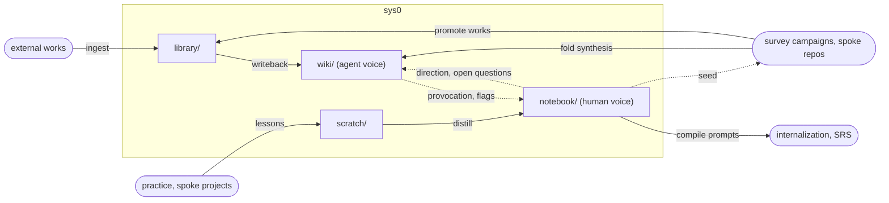

# Knowledge-layer redesign

Design session, 2026-08-15/16. First-principles revisit of what this
repo is, triggered by the idea of a human-authored notebook layer
(prompted by Jon Sterling's forest). Decisions below are settled but
not yet executed except where noted.

## The four layers

Solid arrows move content; dashed arrows move direction. The
invariants are the arrow discipline: evidence travels only on solid
arrows (wiki's inbound solids come from the library alone — there is
deliberately no notebook→wiki solid arrow, and no wiki→notebook one
either: agents flag, humans write); direction runs counter-flow on
dashed arrows out of notebook. Reading is not an arrow — anything may
read anything; arrows show where residue accumulates.

Layer identities, one distinguishing axis each (no single 2×2 — the
capture×authorship matrix that first exposed the notebook gap
misplaces scratch, which is mixed-author by design, and library notes,
which are per-work distillation, not capture): scratch is the only
ephemeral layer; library the only external-origin layer; wiki and
notebook are where alone authorship becomes a directory boundary. At
capture, provenance is a label; at synthesis, voice is the product.

- **scratch** — shared inbox, author-labeled, expires at reseed.
  Stays mixed: at capture, provenance is a label; at synthesis, voice
  is the product and gets a directory boundary.
- **library** — shared intake. Per-work notes stay (they are the
  zero-categorization layer: the citekey is a mechanical key, and they
  defer topic assignment to synthesis time). Altitude rule: notes are
  about the work; relations sections point, never argue. A relations
  section that starts arguing is a wiki page trying to be born.
  Precedent: headnote vs. West's Digest — the cross-source topical
  compilation is a distinct genre from the per-item note.
- **wiki** — agent synthesis lane. Pages are defined by their lens,
  not their source set; sets overlap, never partition, are computed
  from citations (backlinks), never curated. Multi-scope without
  hierarchy: broad pages earn existence like any page and defer detail
  via links (Wikipedia summary style). Genre-flexible, provenance-
  rigid: contradiction flags, gap notes, terminology maps all welcome;
  every claim traces into the library.
- **notebook** — human synthesis lane; Bili's public thinking. Not
  just synthesis-of-sources: claims, conjectures, research questions —
  epistemic status as a line on the page, never a directory. Research
  ideas live here as the frontier surface (Hamming's problem list,
  agent-run). Voice rule: agents never author prose here; mechanical
  link retargeting excepted. Granularity starts page-shaped; atomize
  on felt need. Tooling waits for felt friction.

## Invariants

- **Evidence flows up.** Wiki cites the library only — never
  notebook (opinion laundering), never un-ingested works. Wiki pages
  declare their evidence basis; shelf-claims ("the works here…") are
  free, field-claims ("most work…", "nothing does…") require a
  systematic sweep or survey behind them.
- **Direction flows down.** Notebook open questions steer wiki
  tending, nominate sweeps, seed campaigns. Direction chooses
  questions, never conclusions.
- **Prose never crosses.** Both ways: agents don't write notebook;
  Bili doesn't hand-edit wiki — re-direct the synthesis or dissent in
  notebook.

Vs. Karpathy's LLM wiki (karpathy2026-llm-wiki): layers and two of
three operations map (ingest → writebacks, lint → tend-wiki +
/evolve). The third, query writeback, is deliberately rejected —
mixed-provenance accumulation is the ACE degradation mode; instead,
residue routes by provenance: sources worth keeping → ingestion queue,
own understanding → notebook, procedure → skills, ephemera → scratch.

## Missing functions (named, not scaffolded)

- **Frontier** — queue lines + notebook open-questions. No directory.
- **Practice** — lives in spokes/lab; lessons return via scratch →
  notebook. Without this loop the system is agent-assisted collecting.
- **Feedback/internalization** — planned as a derived view: SRS
  prompts compiled from notebook pages (marked claims), scheduler
  state outside sys0; failed reviews feed the frontier. Rent (Anki),
  don't build.

## Surveys re-scoped

Not a layer — a campaign pattern that runs the layers hard at one
problem. Wiki does not replace surveys: it distills the shelf
(convenience sample); a survey constructs the corpus (sampling frame
licenses coverage/prevalence/negative claims). Perfect wiki on a
biased shelf is the dangerous case — fluency masks incompleteness.

Future surveys are born as self-contained spoke repos: vendored dated
skill copy (provenance header; generalizable lessons upstream via
/evolve), pinned dev-image digest, shared store tier, own shadow if
needed. Closeout promotes: works → library, living synthesis → wiki,
pointer → sys0. Publications freeze; currency is wiki's job; updates
are editions, not upkeep. Only publication-grade campaigns earn repos;
targeted sweeps (the middle tier, not yet built) stay in sys0. Seam
details deferred.

## The naming campaign

Question: better names than scratch/library/wiki/notebook, especially
the agent lane. Method: blind reader panels — fresh agent instances,
no context, shown the listing under one name variant each, staged
guesses then reveal — 17 readers across two runs, plus a 2-designer
reverse test (contract → propose names) and a prior-art sweep
(waste book → ledger; florilegium; Handbuch/Justinian's Digest;
Cahiers).

Results: scratch and library at ceiling (keep). notebook takes a
Jupyter misread but recovers instantly and nothing beat it (keep).
Agent lane: handbook read as a human how-to manual 2/2 and inverted
the authorship contrast (withdrawn); waiki opaque (typo/username
parse; ai-substring transmitted ≤1/5); atlas read as map-of-repo;
daigest parsed typo-first 3/3, pun redundant; synthesis generic across
both lanes + program/logic/evidence-synthesis collisions in exactly
this repo's fields; reviews fatally adjacent to surveys/. digest was
the analytical winner — sole 5/5 on agent-authorship inference
name-alone, ingest→digest composition — but the deployed surfaces
(notebook contrast, site gloss, per-page evidence-basis line) carry
authorship regardless of name, shrinking the name-alone gap to a hair.

Settled: **wiki stays.** Era-drift (the word is becoming the genre
term for agent-maintained knowledge bases), LLM-wiki lineage, zero
churn, durable felt preference. A chosen name now, not a default —
reopen only on observed reader confusion that the gloss and
evidence-basis line fail to fix.

## Execution queue

1. Create notebook/ + codify voice rule, epistemic-status line,
   evidence-basis convention in AGENTS.md (same change); add notebook
   collection to the site.
2. First notebook pages: this redesign's story is seed material; the
   parked HW-spec survey idea moves up from scratch.
3. Later, per triggers: sweep tier, SRS skill, survey spoke-repo
   seams, tend-wiki additions (summary-style pattern at first broad
   page; retarget-links carve-out).
4. Ingestion candidates surfaced: Bush "As We May Think", SuperMemo /
   incremental reading, Forte, Gwern.

This note is itself scratch → notebook seed: distill before reseed.
