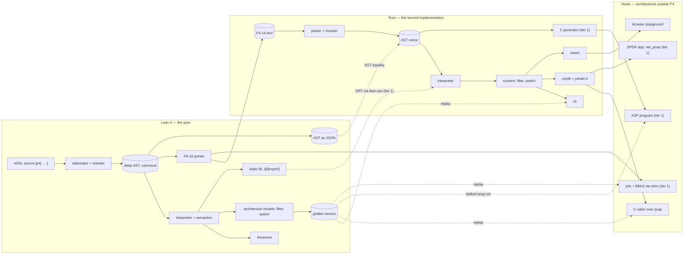

# P4NAH exploration: from a Lean eDSL to a block-is-a-function demo

Superseded on 2026-09-19 by `p4nah-design.md` in this directory,
which is the design of record. This note is kept as the exploration
that led there: two days of design passes, research fan-outs and
prior-art maps, with sections that argue with each other because
they were written before and after rulings. Read the design note for
what the project is; read this for why.

Bili's design idea, developed in conversation over one session. P4NAH
is a subset of P4-16 whose blocks — parser, control, deparser — mean
something on their own: each is a total function with a formal
semantics in Lean 4, and an *architecture* (the thing P4 calls
v1model, PSA, PNA) is ordinary code in a host language that calls
those functions. The name expands to **P4, No Architecture Hardcoded**
and also reads as "P4? nah" — P4 with the part that never belonged in
the language shrugged off. The deliverable planned here is a
proof-of-concept repository, `p4nah-demo`, not a product.

Third pass at one idea. The first, p4moda (2026-06), was a
protobuf-and-Wasm block ABI with architectures as glue in any
language; the second, p4lean/p4neer (2026-08), moved the semantics
into a Lean eDSL and split the P4-facing profile from its Lean home.
This note was designed from a blank page and then compared against
both; the comparison is a section at the end, so the design does not
inherit decisions it did not re-earn.

Method note: claims below are primary-source-cited from four
single-agent web passes (2026-09-18: Lean wasm and FFI, Rust-against-
Lean validation, the P4 software-target ecosystem, a name sweep) plus
direct fetches (the tutorial `basic.p4`, the bpftool and BPF_PROG_RUN
kernel docs, DPDK's pcap device). Not panel-verified; re-check
load-bearing claims before anything durable.

## The thesis, stated honestly

P4-16 already separates the language from the architecture: the spec
says a block's behavior outside a package is undefined, and every
formalization of P4 has had to invent block-level semantics to say
anything at all (HOL4P4's contribution list includes an architectural
semantics of its own; Petr4 parameterizes over architectures and
externs). P4NAH makes the formalizers' workaround the language's
definition: a block is a function, composition is function
composition, and there is no `package` and no `main`.

What *is* hardcoded, because something must be: a **block calling
convention**. Three block kinds with fixed parameter roles —

```p4
parser  Parser<H, M>(packet_in pkt, out H hdr, inout M meta);
control Control<H, M>(inout H hdr, inout M meta);
control Deparser<H>(packet_out pkt, in H hdr);
```

— plus the rule that a block performs no effects. A control block
writes fields of `M`; whoever called it reads those fields afterwards
and does the dropping, forwarding, or replicating. This is PSA's own
deferred-execution model (control blocks write
`psa_ingress_output_metadata_t`, the packet replication engine acts
on it after the block returns) promoted from one architecture's
prose to the language's only rule. A convention this small is not an
architecture: it fixes no port width, no metadata struct, no
pipeline shape, no extern set. The claim "no architecture hardcoded"
means exactly that the fixed point is the calling convention and
nothing above it.

Two consequences worth naming up front. A parser is a pure function
of bytes (plus `M`, zero-initialized on a fresh packet) — it sees no
port and no timestamp — so parser equivalence stays a decidable
question in the Leapfrog class. And the round-trip theorem
`deparse (parse bs) = bs` on well-formed packets, which no
architecture-bound P4 can even state, is a theorem about two P4NAH
functions.

## The subset

The selection rule: **a subset of P4-16 by construction, a
refinement of it by definition.** The subset is defined on the
abstract syntax, and the abstract syntax has two textual renderings:
the Lean eDSL, which keeps P4's vocabulary (header, parser, state,
transition, select, table, action, apply, emit) but is otherwise
Lean-native wherever P4 syntax fights Lean's parser (`bit 9` rather
than `bit<9>`, Lean's own field paths and literals), and P4-16 text,
produced by a printer from the AST. The printer's output is valid
P4-16 for every program in the subset, so a P4NAH program compiles on
stock p4c once wrapped in a shim package, and the P4 text is what
the Rust front end and the playground read. The correspondence is
one-to-one and mechanical; fidelity of surface syntax was
deliberately not a goal, because it buys paste-in convenience at the
cost of a parser spike, and paste-in is served by the Rust side
anyway. Where P4-16 leaves a behavior undefined or target-dependent,
P4NAH picks one, so a P4NAH program's meaning on any conforming P4
target agrees with its Lean meaning wherever P4 defines one. That is
the precise form of "leverage P4's popularity": nothing in the AST is
unprintable as P4, and nothing is left open that a prover would need
closed.

What is in the proof-of-concept subset, chosen so that the
`basic.p4` of the p4lang tutorials (IPv4 forwarding with an LPM
table) fits with only its `standard_metadata` references renamed:

- Types: `bit<N>` with concrete `N`, `bool`, `header`, `struct`,
  `enum`, `error`, `typedef`. Header stacks of fixed depth are the
  first extension after the demo; `varbit` and `int<N>` are out.
- Expressions: bitvector arithmetic and logic with P4's wrap-around
  and shift rules, slicing, concatenation, casts between widths,
  comparisons, `isValid`/`setValid`/`setInvalid`.
- Parser: states, `extract` of fixed-size headers, `lookahead`,
  `advance`, `select` with values, masks and ranges, `verify`,
  `accept`/`reject`. The state graph must be acyclic — checked at
  elaboration — so the interpreter is total without fuel; bounded
  header stacks later reintroduce cycles with fuel equal to the stack
  depth.
- Control: actions with data-plane parameters, tables with `exact`,
  `lpm` and `ternary` keys, `default_action`, `const entries`,
  `apply`, `if`/`else`, `switch` on `action_run`, `hit`. No loops,
  because P4 has none: per-packet execution is straight-line and
  bounded by construction.
- Deparser: a sequence of `emit`, each a no-op on an invalid header.
- Externs: none built in. An extern is a typed signature declared in
  a library file, and every extern has a concrete model in Lean and a
  concrete implementation in Rust that agree — a real checksum, a
  real CRC — because the vectors must pin its output. Abstraction
  over an extern is a proof technique, not an implementation tier:
  a theorem may quantify over any function of the extern's type, and
  most theorems about a forwarding block do. Stateful externs
  (registers) are a later tier, out of the demo. Anything
  nondeterministic or target-supplied — timestamps, random numbers,
  port counts — is an extern or a metadata field, never a language
  intrinsic.
- Out entirely: `package`, `main`, the preprocessor, generics beyond
  the three block signatures, annotations other than `@name`,
  `match_kind` extension, extern object instantiation syntax.

Behaviors P4 leaves open that P4NAH closes: reading a field of an
invalid header yields zero; `extract` past the end of the packet
raises `PacketTooShort` and the parser rejects; a parser rejection is
a value — the parser's result type is `Except ParseError (H × M)` —
and what happens next is the architecture's decision, the same way a
dropped packet is. Every such choice is listed in one file, because
that list is the spec's contract with P4 compilers.

## Semantics in Lean

**Embedding.** A P4NAH program is written inside a Lean quotation,
`[p4| … ]`, in a syntax that reads as P4 to a P4 programmer and
parses as Lean to Lean. The mechanism is lean-mlir's: a custom
syntax category parsed by Lean's own parser, an elaborator that
resolves names and widths and reports domain errors on the eDSL's
source spans, and a deep-embedded abstract syntax tree as the
result. The eDSL inherits Lean's language server for free, which an
external P4 tool has not achieved in a decade.

**The AST is the canonical representation.** It is a Lean inductive
type, and that definition is the one home of the language's shape;
every other form is derived from it. The printer renders it as
P4-16. `deriving ToJson, FromJson` gives a JSON codec in one line,
and JSON is the interchange format of the demo: the Rust types
mirror the inductive through serde, and the corpus round-trip (Lean
AST → P4 text → Rust parse → equal AST, and Lean JSON → Rust decode
→ equal AST) is the check that the mirror is faithful. A schema-first
codec is the upgrade when a third consumer appears: Cedar's Lean
model carries its own in-tree protobuf decoder (`Protobuf` and
`CedarProto` packages in
[cedar-lean](https://github.com/cedar-policy/cedar-spec/tree/main/cedar-lean)),
so that path is precedented, but a `.proto` is a second definition
that must be kept equal to the inductive, and the demo does not need
one. The AST is untyped in the Cedar shape — a plain inductive with a
separate well-formedness checker and, later, a checker-soundness
theorem — rather than intrinsically typed, because an intrinsically
typed AST fights serialization and every consumer other than Lean.

**Values, and `bit<N>` on each host.** In Lean a `bit<N>` value is
core's `BitVec n` — width in the type, arithmetic modulo `2^n`,
`++` typed as `BitVec (n + m)`, `bv_decide` for goals over concrete
widths. P4's rules were chosen to match: unsigned arithmetic wraps
and a shift by at least the width yields zero, which is exactly what
`BitVec` does. The interpreter, being an evaluator over a deep AST,
holds values of runtime width — a dependent pair of a width and a
`BitVec` of that width — and the width checks that every operation
needs are discharged once by the checker rather than at every step.
Concrete widths only: symbolic widths are outside `bv_decide`'s reach
and outside what the AST can carry anyway. `Bool`, structs as field
maps, headers as a validity bit plus fields; packets are byte
arrays.

Rust has no width in the type on stable — `generic_const_exprs`, the
feature that would type `concat` as `n + m`, has no stabilization
path in the 2026 project goals — and an interpreter would not use it
if it did, since the AST decides widths at runtime. The Rust value
is a width plus a `u128` payload with masking, which covers every
width in the demo and IPv6, and a big-integer fallback beyond that if
a program ever asks. This is also what a Rust P4 runtime ends up
with in practice: x4c represents every value as a `bitvec`
`BitVec<u8, Msb0>`, does arithmetic by loading into `u128`, and keys
tables with `BigUint`
([lang/p4rs/src/lib.rs](https://github.com/oxidecomputer/p4/blob/main/lang/p4rs/src/lib.rs)).
Generated C for XDP maps widths to `u8`/`u16`/`u32`/`u64` with masks
and wider fields to byte arrays, as p4c-ebpf does; the wasm build is
the Rust value unchanged.

**Interpreter.** Three functions, total by construction:

```
parse   : Prog → Packet → Except ParseError (H × M × Nat)  -- bytes consumed
control : Prog → TableEntries → H × M → H × M
deparse : Prog → H → Packet
```

Tables are parameters, not state: a control's denotation is a
function of the entries the control plane installed, and match
semantics (longest prefix, ternary by priority, exact) is a small
total function with its own lemmas. The interpreter is the normative
semantics and the reference implementation at once; a `lake`-built
CLI runs it on a program, a packet and a table file, and emits the
result as JSON.

**Theorems the demo should carry.** Two metatheorems that hold for
every program in the subset: the parser consumes at most the packet
length and never reads past it, and the round-trip
`deparse (parse bs).headers = bs` on packets the parser accepts with
every emitted header valid. One program-specific theorem as the
stretch: for the demo's forwarding block, every non-dropped packet
leaves with its TTL decremented, discharged by unfolding the
interpreter on the concrete AST and finishing with `simp` and
`bv_decide`. Whether program-specific proofs stay push-button at
this size is a spike question, not a promise.

## Architectures, one level up

An architecture is a function from block denotations to a device.
In the demo it is written twice, on purpose: once in Lean, as the
*model* — the thing theorems are about — and once in Rust, as the
*runner* — the thing packets go through. The demo carries two
architectures over the same blocks, chosen to be as different as
possible:

- **filter**: parser → control → verdict. One packet in, the same
  packet out or nothing. Its metadata contract is one field,
  `drop : bool`. This is the shape of p4c's `ebpf_model` and of an
  XDP program.
- **switch**: parser → ingress → deparser over `N` ports, with
  drop, unicast to `egress_port : bit<9>`, and flood. Its contract is
  three fields, one of them (`ingress_port`) provided *to* the block.

**The metadata contract** is the mechanism that keeps blocks generic
while architectures stay expressive. A block's `M` is whatever struct
the program declares. An architecture publishes a *requirement*: a
set of named fields with widths, each marked *provided* (the
architecture writes it before the block runs) or *consumed* (the
architecture reads it after). Composition checks structurally that
the program's `M` has those fields at those widths — a decidable
check in Lean, the same check in Rust at load time — and nothing
else about `M` is anyone's business. No architecture ever defines a
metadata *type* the program must import; the direction discipline
(which fields are facts, which are effects) lives in the
architecture's declaration, not in nominal P4 structs. A block
written for the switch runs under the filter unchanged if its `M`
happens to carry `drop`.

Why architectures are code rather than data. A pipeline-description
language — "run these blocks in this order, interpret these fields
thus" — would be a fourth block kind by another name and would need
its own semantics and its own second implementation. Code in the
host language costs nothing to define, gets Lean's proof tooling in
the model and Rust's performance in the runner, and its correctness
is checked the same way the blocks' is: device-level vectors
(packet in on port p → packets out on ports) that both
implementations must reproduce. The Lean model of an architecture is
under thirty lines; that number is the demo's argument that
"architecture" was never the hard part.

## Interop: the AST is the ABI

**Lean is the spec and the oracle, never the data path.** Lean
compiles to C and exports `@[export]` symbols callable from C with a
two-call initialization (v4.34 made runtime initialization implicit,
[lean4#14505](https://github.com/leanprover/lean4/pull/14505)); Cedar
links its Lean model into a Rust process this way through
[lean-sys](https://crates.io/crates/lean-sys). So the Lean
interpreter *can* sit inside a C test harness or a Rust fuzz target,
and in tier 1 of the demo it does. It is not what DPDK or XDP calls per packet:
the shared library is in the 100 MB class, foreign threads must
register with the runtime, and Cedar's own FFI warns it can run one
Lean thread. The interop story therefore has three layers, and Lean
occupies only the top one:

1. **The serialized AST.** The elaborator exports the deep AST as
   JSON and prints it as P4-16; every other component consumes one
   of those two or produces an equal AST from them. Semantics
   attaches to the AST; both encodings are inert.
2. **The Rust engine as a C library.** The `p4nah` crate builds as
   a `cdylib` with a header of five functions: load a program and
   its tables, bind an architecture, run one packet with an output
   callback, free. That is the surface a C or C++ stack calls. The
   demo's C caller is fifty lines over a pcap; the DPDK proof point
   is the same call inside a minimal EAL application whose port is
   the `net_pcap` virtual device (`--vdev
   'net_pcap0,rx_pcap=in.pcap,tx_pcap=out.pcap'`,
   [DPDK docs](https://doc.dpdk.org/guides-24.11/nics/pcap_ring.html)),
   so the DPDK path runs on a laptop with no NIC and no hugepages
   and its output pcap is checked against the same vectors. DPDK's
   native P4 shape — SWX pipelines built from a `.spec` file with a
   mailbox-style extern ABI — is a compiler backend, not a library
   call, and is out of the demo.
3. **Generated C for eBPF/XDP.** No interpreter runs under the
   verifier, so the kernel host needs a code generator: AST to
   restricted C, compiled with `clang -target bpf`, in the shape
   p4c-ebpf established. The XDP program *is* the architecture: a
   prologue that binds `xdp_md` bounds to the packet, the generated
   parser and control, and an epilogue that maps the metadata
   contract to `XDP_PASS`/`XDP_DROP`/`XDP_TX`/`XDP_REDIRECT`. The
   oracle needs no interface either: `bpftool prog run` executes a
   loaded XDP program on a user-supplied packet through the kernel's
   `BPF_PROG_RUN` facility and writes the output packet to a file
   ([bpftool-prog(8)](https://www.mankier.com/8/bpftool-prog),
   [kernel docs](https://docs.kernel.org/bpf/bpf_prog_run.html)), so
   the golden vectors replay in the kernel exactly as they replay in
   Rust. Rust source for aya-ebpf (bpf-linker 0.11.1, 2026-09) is
   the alternative emission target; C is chosen because it is also
   what a DPDK backend would emit later, and because p4c-ebpf is a
   worked example of the verifier constraints (bounds checks on
   every access, bounded loops, the instruction budget).

What the ecosystem already fixed, and why this design does not: each
software backend hardcodes its own metadata struct and extern set —
p4c-ebpf's `ebpf_model` is parser plus a `filter` control with `out
bool accept` and no deparser; `xdp_model` is three blocks around
`xdp_input`/`xdp_output`; ubpf has a `standard_metadata`; Oxide's
[x4c](https://github.com/oxidecomputer/p4) compiles only its own
`SoftNPU` package with fixed ingress and egress metadata structs and
`todo!()` for `error`, `int` and `varbit`
([README](https://github.com/oxidecomputer/p4/blob/main/README.md),
[issue #192](https://github.com/oxidecomputer/p4/issues/192) asking
for v1model). Every one of them is a P4NAH architecture waiting to
be written as thirty lines of host code plus a metadata contract;
`ebpf_model` in particular is the `filter` architecture of the demo
up to the sign of one boolean (`accept` there, `drop` here). The parts of the ecosystem that tried to do this in-kernel
did not land: p4tc is out of tree and blocked since mid-2024
([LWN](https://lwn.net/Articles/977310/)); NIKSS's runtime last
committed 2024-04. BMv2 remains the reference (1.15.6, 2026-09-02)
and is where the "syntactic subset" claim gets tested: exporting a
P4NAH program as a `.p4` file plus a v1model shim package and
running it on stock p4c and BMv2 against the same vectors.

## Rust against Lean

The Rust implementation is a full second implementation — front end,
checker, interpreter, runners — never a translation. What makes that
safe is the Cedar pattern, which as of this week is still the only
instance of "Lean is the spec, Rust ships" with a release discipline
behind it
([cedar-spec](https://github.com/cedar-policy/cedar-spec), Lean
v4.34.0, last commit 2026-09-15). The menu, ranked by assurance per
unit cost for a first-order, loop-free-per-packet interpreter:

1. **Golden corpus.** The Lean CLI emits (program, tables, packet →
   result) vectors for every example and for seeded random packets;
   the Rust crate replays them in `cargo test`. Zero linking, runs on
   every pull request. The Wasm spec `.wast` suite and RISCOF's
   Sail-signature comparison are the same pattern at scale.
2. **Differential random testing, in process.** Cedar links its Lean
   library into the Rust fuzz target through
   [lean-sys](https://crates.io/crates/lean-sys) and `lake build
   …:static`, marshals inputs as protobuf bytes into a Lean byte
   array, and `assert_eq!`s the results; generators are
   type-directed (schema, then conforming requests), which found bugs
   faster than coverage guidance alone ("How We Built Cedar",
   [arXiv 2407.01688](https://arxiv.org/html/2407.01688v1)). For
   P4NAH the order is program, then tables conforming to its keys,
   then packets conforming to its parser — all derivable from the
   AST. Nightly, not per-PR.
3. **Kani bounded harnesses** on the Rust side for the boundary code —
   byte extraction at packet ends, LPM prefix arithmetic — where the
   s2n-quic experience is that model checking finds in seconds what
   fuzzing missed in millions of runs
   ([Kani at scale, 2026](https://arxiv.org/abs/2607.01504)). Checks
   Rust-stated properties, so it complements rather than replaces the
   oracle.
4. **Aeneas + Charon**, translating the Rust interpreter into Lean and
   proving it refines the Lean interpreter. Lean is one of Aeneas's
   two mature backends and Microsoft's SymCrypt has 16.7 KLOC of Rust
   verified this way (report dated September 2026,
   [arXiv 2609.15648](https://arxiv.org/html/2609.15648)); nightlies
   only, no releases, and a documented subset (no interior
   mutability, no `&mut` in generics, no raw pointers). A deep-AST
   interpreter over bitvectors and structs fits the subset *if it is
   written for it from day one*. Named here as the stretch that would
   make "formally verified against the Lean spec" literally true;
   not in the demo's must list.

Rejected: Verus (a second spec language that cannot consume the Lean
one) and shipping Lean-compiled code as the runtime (no production
precedent found; Cedar itself ships Rust and keeps Lean as
specification and oracle, with the Lean authorizer measured at
comparable latency but never deployed).

The parser side of the Rust front end gets its own check for free:
for each corpus program the Lean side exports the AST as JSON and
prints it as P4-16, and the Rust parser must produce an equal AST
from that P4 text.
Random *program* generation is deferred; random tables and packets
over fixed programs are where the bugs in an interpreter live.

## Playground in the browser

The Rust crate compiled to `wasm32-unknown-unknown` through
wasm-bindgen is the playground; nothing else runs in the browser.
The page is static: a P4 editor, a table-entry editor, a packet as
hex or a dropped pcap, an architecture selector, and a run button
that shows the parser's state trace, table hits with the matched
entry, the metadata after each block, and the output packets per
port. Runs are bit-identical to CI because it is the same crate, so
every golden vector doubles as an example you can edit, and a share
link (program, tables, packet in the URL fragment) is the bug-report
and teaching medium. Kaitai's web IDE is the precedent for how much
this mattered to the one binary-format DSL that reached tooling
maturity.

Running the Lean interpreter itself in the browser was checked and
declined for the demo. Lean's official wasm build stopped at v4.15.0
and the CI job has been disabled since 2024-12-20 for memory reasons
([lean4#6424](https://github.com/leanprover/lean4/pull/6424));
the Emscripten branch survives on community patches (a runtime stub
mismatch, [#14973](https://github.com/leanprover/lean4/issues/14973),
open; `-pthread` forced on, so pages need cross-origin isolation,
[#15186](https://github.com/leanprover/lean4/issues/15186), open).
The workable route — `lean -c`, cross-build only `leanrt` with
Emscripten, link with LTO — gave a 0.2 MB module for a string probe
([one 2026-09 write-up](https://github.com/mizchi/formal-methods-playground/blob/main/docs/lean-c-wasm.md));
an interpreter with `Init` linked is unmeasured. Worth one afternoon
as an experiment because "the normative semantics, running in your
tab" is a better sentence than "an implementation tested against
it", but it is a spike, not a plan; lean4web itself runs Lean on a
server.

## The system in one picture

Solid arrows are data flow; dashed arrows are checks. Every host is
an architecture written outside P4, and every host must reproduce
the vectors.



## The end-to-end demo

**One program, three hosts.** The tutorial's `basic.p4` — the first
P4 program most people ever compile — with its `standard_metadata`
renamed to a program-declared `M` and its checksum call bound to the
one library extern, run unchanged under three architectures written
in three languages, none of them P4: the Lean model (what the
theorems are about), the Rust runner (what the CLI, the C header and
the browser call), and an XDP program (what the kernel runs). Each
architecture is small enough to show on one slide next to the
metadata contract it declares. That is the whole argument: the
blocks never changed, the architecture was always the small part,
and it was never the language's job.

Tiers, in build order:

- **Tier 0, the demo proper.** Lean: `[p4| … ]` elaborator for the
  subset, AST with JSON export, interpreter, the `filter` and
  `switch` models, the two metatheorems, a CLI that emits vectors.
  Rust: parser (AST-equal to Lean's on the corpus), checker,
  interpreter, both runners, vector replay in CI, the `cdylib` and
  header, the C caller over a pcap, the wasm build and the static
  playground page. Everything here runs on macOS.
- **Tier 1, the proof points.** The XDP code generator and its
  `bpftool prog run` replay (Linux, a container suffices). The DPDK
  application over `net_pcap`. In-process differential random
  testing with the Lean library linked through lean-sys, nightly.
  The `.p4` export with a v1model shim, run on BMv2 against the
  vectors. The program-specific TTL theorem.
- **Tier 2, the research edges.** Aeneas translation of the Rust
  interpreter and a refinement proof against the Lean one. The
  Lean-in-wasm afternoon. Fixed-depth header stacks, which bring the
  first parser cycle and the first fuel argument.

Repository shape for `p4nah-demo`: `lean/` (the language: syntax,
elaborator, AST, semantics, architectures, theorems, CLI), `rust/`
(the `p4nah` crate with `cli`, `ffi` and `wasm` features), `include/`
(the C header), `examples/` (the P4NAH `basic.p4`, its tables, its
pcaps), `vectors/` (emitted by Lean, committed, replayed by
everything else), `c/` (the caller and the DPDK application), `xdp/`
(generator output and loader script), `web/` (the playground). The
vectors directory is the spine: a component belongs in the demo when
it reproduces the vectors, and the README's status table is that
matrix.

## Two motivations added after the review

Written after the sections above and after a first-principles
review of them; the tiering in the demo section predates these and
a re-ordering is proposed in conversation, not yet settled.

**ONNX as the model.** ONNX is a portable semantic representation
for neural-network models; P4NAH's AST is meant to be the same thing
for packet-processing blocks, with the one thing ONNX never had — a
semantics (SONNX's existence is ONNX's own admission). Consequences:
the AST and its codec are the public artifact, not an internal
detail, which pulls the schema-first codec (protobuf, opset-style
versioning, the Cedar in-tree decoder as precedent) forward from
"when a third consumer appears" to "before the first release"; the
frontends that matter are *exporters* — P4 text through the Rust
parser first, p4c later — because ONNX's adoption came from
exporters and never from native authoring, and the Lean eDSL is the
proof-authoring surface rather than the adoption surface; and the
vectors are the backend conformance suite, with "host" meaning
exactly what "backend" means in ONNX — anything that reproduces
them. The earlier OPPX idea (2026-07, deferred) returns here with a
semantics and a narrower object: P4NAH blocks, not packet processing
in general.

**Spec-driven agentic optimization.** The long-term use: an eBPF
program's performance matters, and if conformance to a P4NAH spec
can be validated, an agent can rewrite the program for speed with
the spec as the guardrail. This flips the product ordering. The
**conformance checker** is the product; the code generator is the
*seed* — a correct baseline the agent starts from — and the
interpreters are oracles. The loop is spec → generated baseline (C
to BPF) → agent rewrite → checker for correctness and `bpftool prog
run … repeat N` for performance (it prints the average duration over
the runs, [bpftool-prog(8)](https://www.mankier.com/8/bpftool-prog))
→ accept or reject. Both oracles run without a NIC; the timing is
not NIC throughput and is honest only as a relative signal.

Checker levels, weakest to strongest:

- L0, golden vectors replayed through `BPF_PROG_RUN`.
- L1, spec-derived inputs: the spec is finite-path by construction
  (parser paths × table outcomes × actions), so symbolic execution
  over the AST yields a path-complete packet set per table
  configuration. No P4NAH-native generator exists yet, and the
  sibling project that would supply a verified one (Eprouvette) has
  not started; the proof of concept uses
  [P4Testgen](https://github.com/p4lang/p4c/blob/main/backends/p4tools/modules/testgen/README.md),
  shipped in p4c, which supports `ebpf_model` on the Linux kernel
  and exhausts all paths with `--max-tests 0`. P4Testgen is trusted
  for *coverage* only: the expected output of every test is
  recomputed by the Lean interpreter, so a wrong P4Testgen
  expectation is caught rather than propagated. A P4NAH-native
  generator over the Lean AST is the later replacement, and the
  place a verified one would be born. This is the minimum guardrail
  for an agent loop: a checker with a few random inputs gets gamed,
  and KernelBench, which checks five random inputs against the
  reference, says as much about its own method
  ([arXiv 2502.10517](https://arxiv.org/html/2502.10517v1)).
- L2, structure-aware fuzzing with swarm and shrinking.
- L3, symbolic equivalence of the BPF program against the spec,
  bounded by packet length, with maps as symbolic arrays. Decidable
  in principle because both sides are loop-free or bounded; it needs
  a BPF semantics and a symbolic executor for it (the Serval and
  Jitterbug lineage); neither exists in this project family yet,
  and it is a project of its own.

Two interface consequences. Conformance is judged at device level —
packet and ingress port in, verdict and packets out — so the XDP
architecture model in Lean is literally the spec of what `XDP_TX`
means, and "architecture at a different level" acquires its purpose.
And an implementation must ship a **table binding**: how the spec's
logical table entries are installed into its maps. The agent may
change map layouts for speed, so the binding is part of what it
edits, and the checker only ever sees logical entries.

Rust's role sharpens under this motivation: the harness (drive
`BPF_PROG_RUN`, install maps, benchmark, shrink), the exporter, and
the production half of the symbolic tooling. The Rust interpreter is
the playground's oracle, not a product.

## Prior art, mapped to the three goals (2026-09-19)

Three read-only research passes (spec-guarded optimization; P4 and
eBPF conformance; portable packet-processing representations), each
primary-source-cited; negatives rest on search absence.

**A portable, formal representation of packet-processing blocks.**

- [XDP2](https://github.com/xdp2-dev/xdp2) (Herbert, XDPnet;
  BSD-2, repo 2025-09, last push 2026-03): a declarative parse graph
  with a JSON "Parser IR" and one compiler emitting the same graph as
  an XDP program or userspace C; DPDK, P4 and hardware are the stated
  vision (invited talk, P4 Workshop 2025-10-13). Prose semantics,
  parser only; match-action is C library code. The closest thing on
  portability, and a natural backend for the parser layer rather
  than a rival.
- [P4-SpecTec](https://github.com/kaist-plrg/p4-spectec) (KAIST,
  Apache-2.0, [arXiv 2608.00639](https://arxiv.org/abs/2608.00639)):
  P4-16's static and dynamic semantics mechanized in the SpecTec
  DSL, generating the prose spec, an executable type checker and an
  interpreter; simulator covers v1model and `ebpf_model`; 24 bugs in
  spec and p4c; no prover backend. "Conditionally adopted as the
  official P4 specification authoring toolchain"; the P4-16 spec
  repository merged a pointer to it on 2026-09-14
  ([p4-spec#1420](https://github.com/p4lang/p4-spec/pull/1420)).
  The closest thing on semantics; the representation is P4 source.
- HOL4P4 and HOL4P4.EXE (VSTTE 2025): mechanized, with a
  CakeML-compiled interpreter proved sound; architectures as
  separate HOL models. [P4MLIR](https://github.com/p4lang/p4mlir-incubator):
  P4HIR plus a BMv2IR dialect, self-described as not ready.
- [NetKAT](https://dl.acm.org/doi/10.1145/2784731.2784761) and
  [KATch](https://dl.acm.org/doi/10.1145/3656454) (PLDI 2024), with
  Google's C++ reimplementation active
  ([google/netkat](https://github.com/google/netkat), push
  2026-09-11): the composition algebra — sequence, union, tests,
  iteration — with decidable equivalence and counterexamples; no
  parsing, no tables with actions.
- Outside networking, the pattern exists: Wasm SpecTec (Rocq and
  Lean backends), [TorchLean](https://arxiv.org/abs/2602.22631)
  (2026: a neural-network graph IR with Lean semantics, executed and
  verified from one definition). Parser DSLs with verified output —
  EverParse/3D, Vest, Daedalus — stop at parsing.
- Gap: nothing serializes parser *and* match-action blocks with a
  mechanized semantics and more than one consumer.

**Architectures as a composable, portable layer.** µP4, Lyra and
Flightplan (earlier notes) compose or split programs but keep a
logical architecture; Petr4 and HOL4P4 parameterize architectures
inside the semantics; XDP2 is the same write-once vision in C.
NetKAT is the only place the composition layer has an algebra with
theorems. Nobody has a *representation* of an architecture. Also
noted: [Nano-P4](https://github.com/pacokwon/nano-p4-spec), an
educational P4 dialect mechanized via P4-SpecTec — precedent for a
subset with its own executable spec.

**A spec as the guardrail for optimizing an implementation.**

- [K2](https://arxiv.org/abs/2103.00022) (SIGCOMM 2021): STOKE-style
  stochastic search over BPF bytecode with Z3 equivalence and safety
  over a first-order BPF semantics; 1–55% lower latency. The spec is
  the compiled program itself. Follow-ups Merlin (ASPLOS 2024) and
  EPSO (2025) trade the SMT gate for rewrite rules.
- [Heimdall](https://arxiv.org/abs/2605.25411) (2026): an LLM
  translates libbpf C to Aya Rust, gated by symbolic execution and
  Z3 equivalence to the original; 109 of 115 verified. The nearest
  "LLM rewrites eBPF, formal gate" system; migration, not
  performance.
- [LLM-VeriOpt](https://2026.cgo.org/details/cgo-2026-papers/37/)
  (CGO 2026): Alive2 equivalence inside the RL reward for an LLVM
  peephole optimizer; [LLM-Vectorizer](https://arxiv.org/abs/2406.04693)
  (CGO 2025): Alive2 as the gate for LLM-vectorized loops. The
  recipe, on LLVM IR.
- [Kops](https://arxiv.org/abs/2606.24213) (2026): Lean 4 proofs
  that native eBPF ops equal their vanilla proof sequences — the one
  Lean 4 use in eBPF performance work; JIT, not rewrites.
- P4 as oracle for real implementations:
  [Gauntlet](https://www.usenix.org/conference/osdi20/presentation/ruffy)
  (OSDI 2020; Z3 translation validation of p4c, 96 bugs);
  [P4Testgen](https://arxiv.org/abs/2211.15300) (SIGCOMM 2023;
  concolic test oracle for v1model, eBPF, PNA, Tofino; the eBPF
  target is a proof of concept with no tracked bugs);
  [SwitchV](https://research.google/pubs/switchv-automated-sdn-switch-validation-with-p4-models/)
  (SIGCOMM 2022; a P4 model as the spec of production switches,
  symbolic packets plus fuzzing, 154 bugs — the scale precedent for
  "P4 model as spec of a non-P4 implementation").
- Why the guardrail must be strong: KernelBench checks five random
  inputs and says so; Sakana's CUDA optimizer found "a memory
  exploit in the evaluation code" and the company conceded
  evolutionary search "can also find ways to trick the verification
  sandbox" ([TechCrunch, 2025-02-21](https://techcrunch.com/2025/02/21/sakana-walks-back-claims-that-its-ai-can-dramatically-speed-up-model-training/)).
- Gap: no work uses a higher-level spec with mechanized semantics as
  the guardrail for optimizing eBPF; every eBPF equivalence check is
  program-versus-program or ISA-level, and every LLM optimizer with a
  formal gate is on LLVM IR.

**What this does to the design.** The block layer should not
re-mechanize P4 in competition with the official toolchain:
P4-SpecTec's interpreter is the oracle for the P4-defined fragment,
and P4NAH's own semantics is validated against it by differential
testing. The novelty sits in the two layers nobody has: the
architecture algebra (NetKAT-shaped over P4-like atoms) and the
guardrail above a spec that is not the program. XDP2 is a backend
and an ally on the parser side, and evidence that a kernel-networking
figure is betting on a portable parser IR right now.

## Naming

*P4NAH*, pronounced "pee-four-nah". Readings:

- the expansion, **P4, No Architecture Hardcoded** — the thesis in
  the name, with *hardcoded* rather than *required* because an
  architecture is still required to run anything; it is just not
  hardcoded into the language, the compiler, or the semantics;
- "P4? nah" — the language, minus the thing being declined;
- `p4` + a short suffix is the ecosystem's own convention (`p4c`,
  `p4app`, `p4runtime`, `p4pktgen`), so it reads as a sibling rather
  than a rival.

Sweep (2026-09-18, registries only): no repositories, users or
organizations on GitHub for `p4nah`, `p4-nah` or `p4nah-demo`; free
on crates.io, PyPI, npm and Lean's Reservoir; no product, paper or
company by web search (hits are an Indonesian handle — *panah*, "bow"
— and a chemistry figure that pairs compound labels "P4-n" with the
reagent NaH). The same registries are also clear for the earlier
working names p4neer and p4lean. "nah" reads as "no" in English and
in Hindi/Urdu, which is the joke, and as "near" in German, which is
harmless. Perforce's 2025 rebrand of Helix Core to "P4" is noted and
not this project's problem. Not swept: domains, trademarks.

## Against the two earlier designs

Kept from p4moda (2026-06): the honesty that a minimal fixed point is
unavoidable and must be named (there: meta-architecture; here:
calling convention), architectures as ordinary software, and v1model
rebuilt as glue as the validation exercise. Dropped: protobuf schemas
as the normative interface and Wasm modules as the block artifact —
the AST is the ABI, Wasm is one distribution target of the engine —
and any dependence on p4c as the compiler.

Kept from p4lean/p4neer (2026-08): blocks as autonomous functions,
effects as metadata, externs as FFI in three tiers, the device model
outside P4, the parser as a pure automaton over bytes, the browser
playground as a milestone. Dropped: the two-layer naming (one name;
the profile is not separately adoptable until someone asks), the
coupling to the Pakeles IR (P4NAH's AST stands alone; the parser
fragment may map onto it later), the p4c backend and BMv2 harness as
core deliverables (now a tier-1 export), and protobuf as the IR
codec.

New here: the metadata contract as a structural, direction-annotated
requirement published by an architecture — replacing both p4moda's
typed `arch_meta` slot and p4lean's "the Lean typing decides"; the
selection rule *syntactic subset, semantic refinement* with the
closed-behaviors list as the contract with P4 compilers; the
three-hosts demo with XDP as a first-class architecture; Rust as a
full second implementation with the assurance ladder made explicit
and Aeneas named as the path to "verified against Lean"; and the
Lean-in-browser question settled by evidence rather than deferred.

## Open items

- Syntax spike first: the eDSL's shape for a header type, a parser
  state with `select`, and a table, through the elaborator, with the
  P4 printer beside it — the spike's exit criterion is that a P4
  programmer reads the Lean form without a legend.
- Rust front end: write a parser for the subset (small) or reuse
  x4c's P4 parser (MPL-2.0, maintained, pushed 2026-09-16) and
  discard its codegen. Decide after reading its AST.
- Extern library contents: which hash (a CRC family as in PSA's
  `HashAlgorithm`) and which checksum ship in the first library, and
  the byte order of their input serialization — the one place the
  Lean model and the Rust implementation can silently disagree.
- Whether program-specific theorems stay push-button at `basic.p4`
  size, or need a symbolic evaluator — the Eprouvette question, and
  the first place that project would be pulled in.
- Ternary priority and `const entries` ordering semantics: pick the
  P4Runtime convention and write it into the closed-behaviors file.
- HOL4P4 comparison, two ways. Conceptual: HOL4P4
  ([kth-step/HOL4P4](https://github.com/kth-step/HOL4P4), pushed
  2026-08) is the one maintained P4 mechanization and carries its
  architectures as separate HOL models (`p4_ebpfScript`,
  `p4_vssScript`, `p4_v1modelScript`) beside a shared core
  semantics; P4NAH carries none, and its architectures are host
  code checked by vectors. Write that delta from the OOPSLA 2024
  paper before any public claim. Empirical: HOL4P4 imports `.p4`
  through Petr4 and has an executable semantics with a soundness
  proof, so its example programs (the VSS TTL example, its v1model
  tests) are a ready corpus, and if the executable semantics can be
  driven from a script, it is a third oracle beside BMv2 and the
  Lean model. The compiled switch of the VSTTE 2025 paper
  (HOL4P4.EXE) is not in the public repository — the CakeML path
  is a `TODO` in `p4_exec_semScript.sml` — so the empirical
  comparison costs a HOL4 build; unverified beyond that.
- Name: domains and trademarks unswept.
- Deferred and unverified: mimalloc under Emscripten and the real
  size of a Lean interpreter as wasm; whether Aeneas's subset holds
  once the Rust interpreter has table maps and packet buffers;
  whether the P4 language working group has any thread on portable
  blocks (none found, minutes not read).
